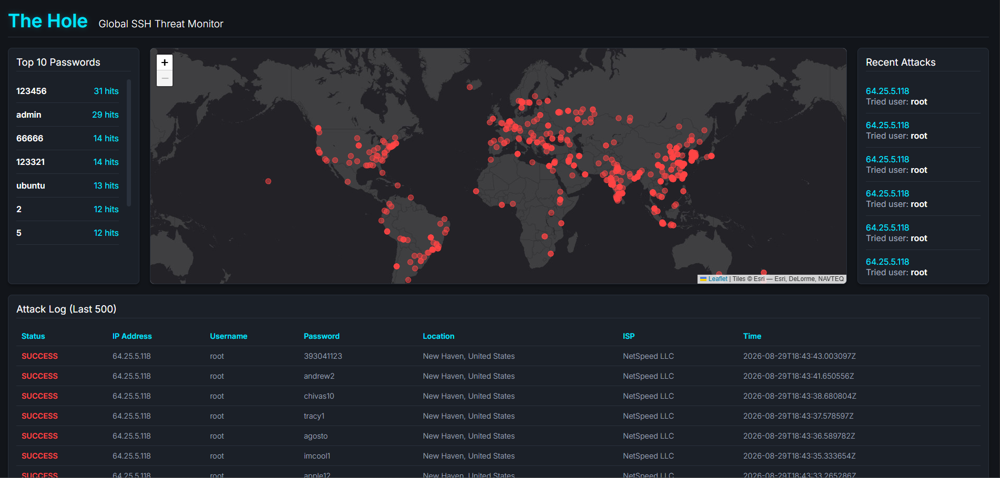
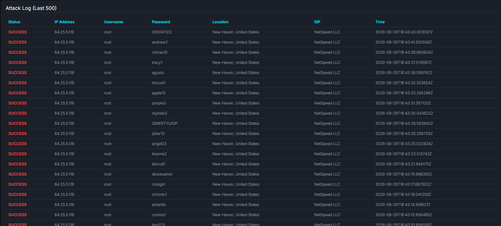
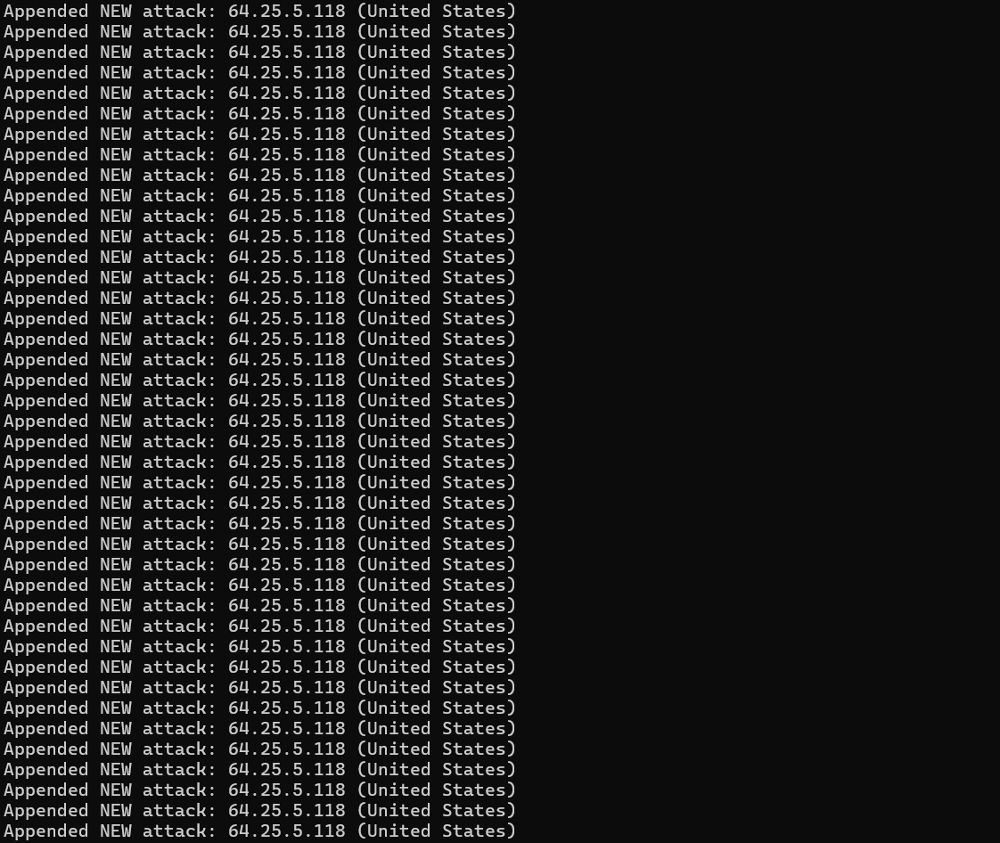

# 🕳️ The Hole - Global SSH Threat Monitor

An automated, containerized SSH honeypot deployed on AWS EC2, featuring a real-time SOC-style global threat monitoring dashboard.

## 🎯 Project Objective

This project was developed as a hands-on cybersecurity and DevSecOps portfolio piece. The goal was to design and deploy a secure, isolated environment capable of attracting, trapping, and analyzing real-world automated botnet attacks and brute-force attempts in real-time. It demonstrates practical application of **Network Security (iptables)**, **Containerization (Docker)**, **Cloud Infrastructure (AWS)**, and **Data Pipeline Automation**.

---

## 🌍 Live Dashboard

**[View the Live Global Threat Monitor Here](https://MorBarak23.github.io/TheHole-Honeypot/)**

_(Note: During the research time, the data is updated dynamically based on real-time attacks hitting the AWS server between the dates 31/05/2026 - 29/08/2026 )._

---

### 📸 Dashboard & Analytics

**Global Threat Map & Web Dashboard**  
_Visualizing the geographic distribution of automated brute-force attacks and common data._  

 

**Last 500 Attacks**  
_Data breakdown of the last 500 attempted attacks (we can see that the last 500+ was a brute force attack from one USA domain)._  

---

## 🛠️ Architecture & How It Works

The system operates as a continuous, automated pipeline:

1. **The Trap (AWS & iptables):**
   Attackers actively scan the internet for open SSH ports. When they hit the AWS EC2 instance on default port `22`, Linux `iptables` NAT rules seamlessly redirect the malicious traffic to port `2222`.
2. **The Isolation (Docker & Cowrie):**
   Port `2222` is bound to a lightweight **Cowrie SSH Honeypot** running securely inside an isolated Docker container. Attackers believe they are interacting with a real Linux server.
3. **Data Logging:**
   Cowrie records every interaction (IP address, guessed usernames, passwords, timestamps) into a local JSON log volume.
4. **Data Parsing & Geolocation (Python):**
   A custom Python script extracts the live container logs, filters out internal Docker SNAT noise (`172.17.0.x`), and queries the `ip-api.com` service to map attacker IP addresses to specific countries, cities, and ISPs.
5. **CI/CD Automation (Bash & Cron):**
   A scheduled Cron job runs a Bash script that merges historical logs, safely triggers the Python parser (with built-in API rate-limit protections), and pushes the updated dataset to GitHub.
6. **Frontend Visualization:**
   The web dashboard consumes the latest CSV data and renders it onto an interactive Leaflet.js map, applying a custom dark theme.

**Automated Data Pipeline**  
_Python extraction engine resolving attacker IP addresses in real-time._  

---

## ✨ Key Features

- **Zero-Interference Logging:** Captures credentials and behavior without exposing the host OS to actual compromise.
- **Rate-Limit Safe:** The processing engine dynamically paces API requests to avoid geolocation service blocks.
- **Automated Data Sync:** The entire dataset is merged and published without human intervention.
- **Interactive Threat Map:** Visualizes attack origins globally using raw coordinates and CartoDB dark tiles.

---

### 📊 Final Research Findings (3-Month Data Collection)

Over a structured 90-day data collection period, the honeypot successfully captured and analyzed **over 79,000 distinct unauthorized access attempts**.

**Core Discoveries:**

- **High-Volume Automated Threats:** The data overwhelmingly points to automated botnets utilizing brute-force credential stuffing, often executing dozens of requests per second from single nodes.
- **Top Targeted Credentials:** The most frequently attempted combinations relied on factory defaults and weak strings. `123456`, `admin`, and `root` accounted for a massive percentage of all hits, proving that hardcoded or default IoT/server credentials remain the most exploited vulnerability on the public internet.
- **Global Distribution:** Threat actors are not localized. The interactive map visualizes attacks originating from highly distributed networks across Asia, Europe, and the Americas, highlighting the necessity of strict IP whitelisting and geo-blocking policies.

---

## 💻 Technology Stack

- **Infrastructure:** AWS EC2 (Ubuntu Linux)
- **Security & Networking:** `iptables` (Port Forwarding/NAT), SSH Configuration
- **Containerization:** Docker, Docker Volumes
- **Honeypot Engine:** Cowrie (Medium interaction SSH/Telnet honeypot)
- **Backend Automation:** Python 3 (JSON parsing, REST API requests), Bash scripting, Linux Cron
- **Frontend:** HTML5, CSS3, Vanilla JavaScript, Leaflet.js, PapaParse (CSV parsing)

---

## 👨‍💻 About the Author

**Mor Barak**  
_Engineering Student at Afeka College of Engineering_  
Passionate about software development, network security, and building scalable cloud architectures. This project was built to bridge the gap between theoretical data structures and algorithms, and real-world infrastructure security.

- **GitHub:** [@MorBarak23](https://github.com/MorBarak23)
